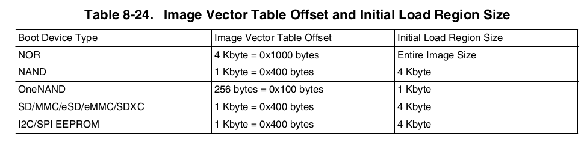

# 第1章：u-boot启动流程
- 板子上电以后，首先执行的是ROM中的一段启动代码。启动代码**根据寄存器/外部管脚配置**，确定是进入下载模式，还是从某介质(Flash/EMMC/SD卡等存储设备)启动u-boot
> ROM中的代码是固化的，无法修改

**先分析架构，不要开始就进入细节**         
------
## 1 从上电到u-boot(EMMC为例)
- 根据IMX6Q数据手册描述:
- 首先启动代码会将EMMC前4K的数据copy到**片内RAM(SOC芯片上的)**.
> 这4K数据中包含了Program Image数据，copy数据长度大小和IVT(镜像向量结构)的偏移量根据**启动设备类型决定**.

### 1.1 Program Image
Program Image是freescale定义的一个镜像数据结构，它里面包括镜像向量表IVT，Boot Data，设备配置数据DCD和用户代码等信息，详见数据手册.



### 1.2 IVT概念
|     Header |  entry | dcd  | Boot Data | CSF|
| :--------------- | :-------------   | :------------- |:------------- | :------------- |
| IVT头部，标识IVT和IVT长度  | 第一条指令的入口地址，也就是U-boot的入口地址 | DCD数据地址，在BOOT Data后面 | Boot Data地址，在IVT后面| CSF地址|

- 其中Boot Data里面包含：

| start | length | plugin flag |
| :------------- | :------------- |:------------- |
| 启动数据加载到内存的地址 | 启动数据加载到内存的长度 | 标志位 |

### 1.3 Boot Device Memory结构图


### 1.4 启动代码拷贝
- 启动代码根据Boot Data的指示，把EMMC中前**Boot Data->length**字节copy到**Boot Data->start地址**的内存位置处.
> 如图所示：其中左边是**启动设备中的数据**，右边是**片上内存中的数据**

- IVT->entry指向**片上内存中Application的位置(蓝线)**，Application也就是U-boot的镜像，最后跳转到IVT->entry指定的地址，进入U-boot.


------
## 2 u-boot启动概览 


### 2.1 arch级初始化 
- 主要是设置SVC模式，关中断、设置寄存器等芯片级别的初始化
```
_start——————>reset——————>设置SVC模式, 关闭中断  
………………………………|  
………………………………————>cpu_init_cp15—————>关闭MMU,TLB  
………………………………|  
………………………………————>cpu_init_crit—————>lowlevel_init—————>关键寄存器的配置和初始化    
………………………………|  
………………………………————>_main—————>进入板级初始化  
```

### 2.2 板级初始化  
- 主要是堆栈，外设等初始化
```
_main—————>board_init_f_alloc_reserve ——————>堆栈、GD、early malloc空间的分配  
…………………………|  
…………………………——————>board_init_f ———————>uboot relocate前的板级初始化以及relocate的区域规划  
…………………………|  
…………………………——————>relocate_code、relocate_vectors——————>进行uboot和异常中断向量表的重定向  
…………………………|  
…………………………——————>旧堆栈的清空  
…………………………|  
…………………………——————>board_init_r —————————>uboot relocate后的板级初始化  
…………………………|  
……………………………………………………——————>run_main_loop ————————>进入命令行状态，等待终端输入命令以及对命令进行处理

```

### 2.3 u-boot.lds链接文件
- u-boot入口文件：/arch/arm/cpu/u-boot.lds; 主要**指示u-boot的入口地址以及ELF各个段的分布**
> b用于**不返回的跳转**，比如跳到xxx标号处，b xxx；bl用于**子程序跳转，要返回地址，返回地址存于LR中；**当发生bl跳转前，会在寄存器R14(即LR)中保存当前PC-4，即bl跳转指令的下一条指令的地址。所以在返回时只要**mov lr, pc** 

```
// 入口地址，定义在vectors.S文件中
ENTRY(_start)

SECTIONS
{
    . = 0x00000000;
    // 4字节对齐的
    . = ALIGN(4);
    .text :
    {
        *(.__image_copy_start)
        // 所有可重定位目标文件的vectors段，其中定义了全局的_start入口
        *(.vectors)
        // start.o文件的.text段,对应的汇编文件是start.S
        CPUDIR/start.o (.text*)
        // 所有可重定位目标文件的.text段
        *(.text*)
    }

    // 各个段的描述
    .......
}
```
### 2.4 /arch/arm/lib/vectors.S
```
// vectors.S文件定义了全局入口_start
_start:
    // 跳转到start.S中定义的reset，正式开始执行u-boot
	b	reset
    // 以下是Exception Handlers Vectors，是芯片规定的，可以查看芯片手册说明
	ldr	pc, _undefined_instruction
	ldr	pc, _software_interrupt
	ldr	pc, _prefetch_abort
	ldr	pc, _data_abort
	ldr	pc, _not_used
	ldr	pc, _irq
	ldr	pc, _fiq
```

### 2.5 /arch/arm/cpu/armv7/start.S
```
// start.S文件
reset:
	/* Allow the board to save important registers */
	b	save_boot_params
    .....
    // 设置SVC模式，关中断等
    mrs	r0, cpsr
    and	r1, r0, #0x1f		@ mask mode bits
    teq	r1, #0x1a		    @ test for HYP mode
    bicne	r0, r0, #0x1f	@ clear all mode bits
    orrne	r0, r0, #0x13	@ set SVC mode
    orr	r0, r0, #0xc0		@ disable FIQ and IRQ
    msr	cpsr,r0

    // 初始化协处理器CP15，禁用MMU和TLB
    bl	cpu_init_cp15
    // 初始化CPU相关的重要寄存器
    bl	cpu_init_crit
    // crt0.S中的板级初始化_main执行
    bl	_main  <===================
    ......

    ENTRY(cpu_init_cp15)
    // 因为系统栈没有初始化，因此使用lr寄存器来保存返回地址
    mov	r5, lr			@ Store my Caller    <===================
    ......
    mov	pc, r5			@ back to my caller  <===================
    ENDPROC(cpu_init_cp15)

    ENTRY(cpu_init_crit)
    // 调用rch/arm/cpu/lowlevel_init.S中通用的lowlevel_init
    // 通常是由板级代码自己实现
    b	lowlevel_init		@ go setup pll,mux,memory
    ENDPROC(cpu_init_crit)
```

### 2.6 arch/arm/cpu/lowlevel_init.S
```
// 设置临时堆栈等
....
// 保存返回地址，之后重新回到start.S文件
push	{ip, lr}
// 跳转到arch\arm\cpu\armV7\mx6\soc.c中做些操作
bl	s_init
// 重新回到start.S文件继续执行_main
pop	{ip, pc}
```

### 2.7 arch\arm\lib\crt0.S
```
// 入口及重要函数
ENTRY(_main)
    // 设置栈顶指针
	ldr	sp, =(CONFIG_SYS_INIT_SP_ADDR)

    // 函数位于common/init/board_init.c
    bl	board_init_f_alloc_reserve
    bl	board_init_f_init_reserve

    // 板前期初始化，common\board_f.c
	bl	board_init_f

    // relocate.S中重定位区域规划，代码重定位
    ......
    b	relocate_code
    // 板后期初始化，common\board_r.c
    ldr	pc, =board_init_r  // 进入主函数
ENDPROC(_main)
```

### 2.8 arch\arm\lib\relocate.S
```
ENTRY(relocate_code)
// 对__image_copy_start等section进行重定位
....
ENDPROC(relocate_code)
```

至此，大致流程分析完毕**     

-------
## 3. 板前期初始化
### 3.1 
### 3.2 
### 3.3 
### 3.4 
### 3.5 
### 3.6 

------
## 4. 板后期初始化
### 4.1 
### 4.2 
### 4.3 
### 4.4 
### 4.5 
### 4.6 

------
## 5. u-boot命令解析
### 5.1 
### 5.2 
### 5.3 
### 5.4 
### 5.5 
### 5.6 
