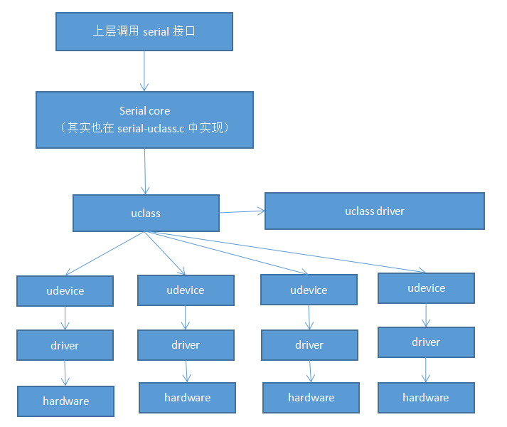

## **第4章-U-boot驱动模型之一基本内容**
### **1. 基本概念**
#### **1.1 全局数据global_data**
某些情况下，u-boot在某些只读存储器上运行，如ROM，NorFlash等；在其重定位到RAM之前，无法写入数据或者通过全局变量传递数据，而global_data(也称GD)则可以解决这个问题
> 简单来说，u-boot把GD放在RAM区，使用它来存储全局数据， 以解决上述场景中无法使用全局变量的问题


**GD数据结构**
```
// include/asm-generic/global_data.h
typedef struct global_data {
    bd_t *bd;  // 保存开发板的相关参数
    unsigned long env_addr;     // 环境变量地址
    unsigned long ram_top;      // RAM空间的顶端地址
    unsigned long relocaddr;    // u-boot重定位后的地址
    phys_size_t ram_size;       // 物理ram的size
    unsigned long irq_sp;       // 中断的栈地址
    unsigned long start_addr_sp;    // stack地址
    unsigned long reloc_off;    // uboot的relocation的偏移
    struct global_data *new_gd; // 重定位后的GD结构体
    const void *fdt_blob;       // dtb地址
    void *new_fdt;              // 重定位后dtb地址
    unsigned long fdt_size;     // dtb的长度
    struct udevice *cur_serial_dev; // 当前使用串口设备
    ......
} gd_t;

```

**初始化GD**
```
// crt0.S
// 设置C运行时环境
ldr sp, =(CONFIG_SYS_INIT_SP_ADDR) // 设置栈顶SP指针，只是预设，并不是最终的栈顶地址
bic sp, sp, #7 // 8byte对齐
mov r0, sp  // SP放入r0
bl  board_init_f_alloc_reserve // 参数为r0，返回后，r0中存放的是GD的地址
mov sp, r0  // r0放入sp中
mov r9, r0  // r0放入r9中，即r0和r9存放的都是GD的地址
bl  board_init_f_init_reserve  // 对GD初始化，r0为参数

// 给GD分配空间,传入的是r0，即栈顶地址
ulong board_init_f_alloc_reserve(ulong top)
{
    // 自顶向下分配CONFIG_SYS_MALLOC_F_LEN大小内存, 用于在relocation前用于给malloc函数提供内存池(给堆用的)
    top -= CONFIG_SYS_MALLOC_F_LEN;

    // 继续向下分配sizeof(struct global_data)大小的内存给GD使用，向下16byte对齐
    top = rounddown(top-sizeof(struct global_data), 16);

    // 返回GD地址
    return top;
}

// 初始化GD分配的空间, 即清空global_data区域
// 传入的参数为GD的基地址
void board_init_f_init_reserve(ulong base)
{
    // 清零
    memset(gd_ptr, '\0', sizeof(*gd));

    // 获取了early malloc的内存池的地址(给堆使用)
    base += roundup(sizeof(struct global_data), 16);

    // 写入到gd->malloc_base中
    gd->malloc_base = base;

    // 获取early malloc的内存池的末尾地址
    base += CONFIG_SYS_MALLOC_F_LEN;
}

```

**使用GD**  
根据上面可得GD的基地址存放在r9中，需要GD的时候，直接从r9寄存器中取的其地址即可
```
// arch/arm/include/asm/global_data.h
#define DECLARE_GLOBAL_DATA_PTR     register volatile gd_t *gd asm ("r9")

// common/board_r.c
DECLARE_GLOBAL_DATA_PTR

static int initr_reloc(void)
{
    // 直接使用gd变量即可
    gd->flags |= GD_FLG_RELOC | GD_FLG_FULL_MALLOC_INIT;
}

```

#### **1.2 驱动模型引入**
在U-boot中引入驱动模型(driver model)，为驱动的定义和范文接口提供统一的方法，提高驱动间的兼容性以及访问的标准性，u-boot中的驱动模型(DM)和kernel中的设备驱动模型类似，但是也有所区别   
> 通过宏定义CONFIG_DM使能驱动模型，对应的实际驱动设备则需要通过使能CONFIG_DM_SERIAL来使能；后面以serial驱动为例

##### **1.2.1 uclass/udevice/drivers三者之间的关联**  
**uclass**可以理解为具有相同属性的device对外操作的接口, 它与上层接口直接通讯，其驱动为**uclass_driver**，给上层提供接口  
**udevice**对具体设备的抽象，对应的驱动是**driver; driver**负责和硬件通讯，为**uclass**提供实际的操作集  
**udevice**如何和**uclass**绑定：**udevice**对应的**driver_id**和**uclass**对应的**uclass_driver_id**是否匹配  
**hardware**对应的**driver**绑定对应的**udevice，udevice**绑定**uclass**，**uclass**有其对应的**uclass_driver**  
> **uclass和udevice是动态生成的**  
1. **udevice**在解析fdt中的设备的时候自动生成，然后**udevice**找到对应的**driver**
2. **driver**中保存了**uclass_id**， 根据它找到**uclass_driver_id**
3. 从**uclass**链表中查找对应的**uclass**是否已经生成，若没有生成，则动态生成  
4. **重点是解析设备树，生成udevice， 并找到对应的driver**



**1.2.2 全局数据GD中和DM相关部分**
```
typedef struct global_data {
   // dts中的根节点，第一个创建的udevice
   struct udevice  *dm_root;

   // relocation之前的根设备
   struct udevice  *dm_root_f;

  // uclass的链表, 挂的是有udevice的uclass
   struct list_head uclass_root;  
} gd_t;
```
