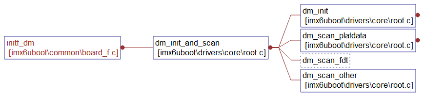
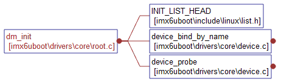
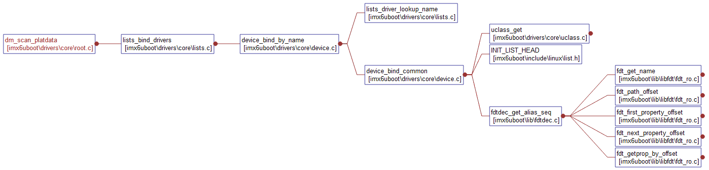
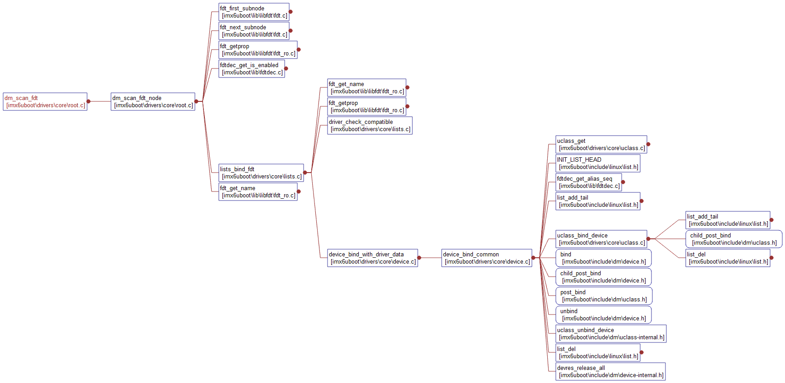
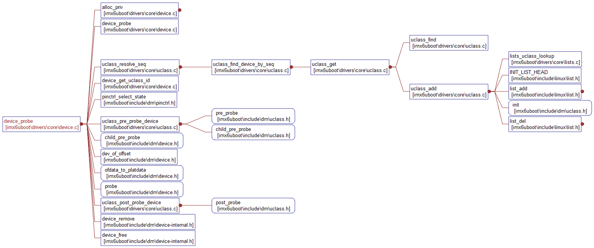

# 流程
// 根据驱动跑一遍
------
## 1. DM的初始化
### 1.1 初始化DM
- 创建根设备root的udevice，放在gd->dm_root中
> 根设备其实是一个虚拟设备，主要为其他设备提供一个挂载点

- 初始化uclass链表**gd->uclass_root**
```
#define DM_UCLASS_ROOT_NON_CONST	(gd->uclass_root)
INIT_LIST_HEAD(&DM_UCLASS_ROOT_NON_CONST); // 初始化uclass

#define DM_ROOT_NON_CONST		(gd->dm_root) dm_root是struct udevice*类型

```

### 1.2 udevice和uclass的解析
1. 创建udevice和uclass   
2. 绑定udevice和uclass   
3. 绑定udevice和driver   
4. 绑定uclass和uclass_driver    
5. 调用部分的driver      

```
ret = device_bind_by_name(NULL, false, &root_info, &DM_ROOT_NON_CONST); // dm的根udevice

//
int device_bind_by_name(struct udevice *parent, bool pre_reloc_only,
			const struct driver_info *info, struct udevice **devp)

/* This is the root driver - all drivers are children of this */
U_BOOT_DRIVER(root_driver) = {
	.name	= "root_driver",
	.id	= UCLASS_ROOT,
	.priv_auto_alloc_size = sizeof(struct root_priv),
};

/* This is the root uclass */
UCLASS_DRIVER(root) = {
	.name	= "root",
	.id	= UCLASS_ROOT,
};

```
------
## 2. 入口说明
> dts节点中的**u-boot,dm-pre-reloc**属性，当设置了这个属性时，则表示这个设备在relocate之前就需要使用

```
// 只对带有“u-boot,dm-pre-reloc”属性的节点进行解析，情况少
dm_init_and_scan(true);

// 对所有节点进行解析，重点说明
dm_init_and_scan(false);
```

### 2.1 dm\_init\_and\_scan说明


```
// driver/core/root.c
int dm_init_and_scan(bool pre_reloc_only)
{
    ret = dm_init();    // DM的初始化

    ret = dm_scan_platdata(pre_reloc_only);  // 从平台设备中解析udevice和uclass

    if (CONFIG_IS_ENABLED(OF_CONTROL)) {
        ret = dm_scan_fdt(gd->fdt_blob, pre_reloc_only); // 从dtb中解析udevice和uclass
    }

    ret = dm_scan_other(pre_reloc_only);
}
```

### 2.2 dm_init
- 创建根设备root的udevice，放在gd->dm_root中, 即创建设备链表头   
- 初始化uclass链表gd->uclass_root, 即创建uclass链表头   

- **driver数组，从u-boot.map中查找**
```
/**
 * ll_entry_start() - Point to first entry of linker-generated array
 * @_type:	Data type of the entry
 * @_list:	Name of the list in which this entry is placed
 *
 * This function returns (_type *) pointer to the very first entry of a
 * linker-generated array placed into subsection of .u_boot_list section
 * specified by _list argument.
 *
 * Since this macro defines an array start symbol, its leftmost index
 * must be 2 and its rightmost index must be 1.
 *
 * Example:
 * struct my_sub_cmd *msc = ll_entry_start(struct my_sub_cmd, cmd_sub);
 */
#define ll_entry_start(_type, _list)
({ static char start[0] __aligned(4) __attribute__((unused, section(".u_boot_list_2_driver_1"))); (struct driver *)&start;})

ll_entry_start(struct driver, driver)

```

 

```
// driver/core/root.c
#define DM_ROOT_NON_CONST       (((gd_t *)gd)->dm_root) // 宏定义根设备指针gd->dm_root
#define DM_UCLASS_ROOT_NON_CONST    (((gd_t *)gd)->uclass_root) // 宏定义gd->uclass_root，uclass的链表

// root_info就实现了一个.name属性，其他为默认值
static const struct driver_info root_info = {
	.name		= "root_driver",
};

int dm_init(void)
{
    // 初始化uclass链表
    INIT_LIST_HEAD(&DM_UCLASS_ROOT_NON_CONST);

    // DM_ROOT_NON_CONST是指根设备udevice，root_info是表示根设备的设备信息
    // 查找和设备信息匹配的driver，创建对应的udevice，和对应uclass绑定，并把udevice放在DM_ROOT_NON_CONST链表中
    ret = device_bind_by_name(NULL, false, &root_info, &DM_ROOT_NON_CONST);

    // 对根设备执行probe操作
    ret = device_probe(DM_ROOT_NON_CONST);
}

// 1. 根据driver的name找到driver，其中名字为"root_driver"
int device_bind_by_name(struct udevice *parent(NULL), bool pre_reloc_only(false),
			const struct driver_info *info("root_info"), struct udevice **devp(gd->uclass_root))
{
	drv = lists_driver_lookup_name(info->name);  
	return device_bind_common(parent, drv, info->name,
			(void *)info->platdata, 0, -1, platdata_size, devp);
}

// 2. 查询driver列表，找到root_driver，并且返回root_driver的地址
struct driver *lists_driver_lookup_name(const char *name)
{
    // 在u-boot.map文件中找到driver列表的起始地址为.u_boot_list_2_driver_1
	struct driver *drv =
		ll_entry_start(struct driver, driver);

 .u_boot_list_2_driver_1
                0x00000000178743a0        0x0 drivers/built-in.o
 .u_boot_list_2_driver_2_asix_eth
                0x00000000178743a0       0x44 drivers/usb/eth/built-in.o
                0x00000000178743a0                _u_boot_list_2_driver_2_asix_eth
 .u_boot_list_2_driver_2_fecmxc_gem
                0x00000000178743e4       0x44 drivers/net/built-in.o
                0x00000000178743e4                _u_boot_list_2_driver_2_fecmxc_gem
 .u_boot_list_2_driver_2_fixed_regulator
                0x0000000017874428       0x44 drivers/power/regulator/built-in.o
                0x0000000017874428                _u_boot_list_2_driver_2_fixed_regulator
                .......................

    // 找到driver列表的end地址
    .u_boot_list_2_driver_3


    // 计算出一共有对个驱动
	const int n_ents = ll_entry_count(struct driver, driver);
	struct driver *entry;

	for (entry = drv; entry != drv + n_ents; entry++) {
		if (!strcmp(name, entry->name))
			return entry;
	}
}

**********************************

/* This is the root driver - all drivers are children of this */
U_BOOT_DRIVER(root_driver) = {
	.name	= "root_driver",
	.id	= UCLASS_ROOT, 0
	.priv_auto_alloc_size = sizeof(struct root_priv),
};
**********************************
//  3. 给定udevice parent, 驱动地址，驱动名字，平台数据，驱动数据，偏移，偏移大小和udevice，返回一个int类型
static int device_bind_common(struct udevice *parent, const struct driver *drv,
			      const char *name, void *platdata,
			      ulong driver_data, int of_offset,
			      uint of_platdata_size, struct udevice **devp)
{
    // 根据driver中保存的id找uclass，如果不存在就创建一个uclass
    ret = uclass_get(drv->id, &uc);
*********************************************************

int uclass_get(enum uclass_id id, struct uclass **ucp)
{
	struct uclass *uc;

	*ucp = NULL;
	uc = uclass_find(id);  // 开始是空的，返回0
	if (!uc)
		return uclass_add(id, ucp);
	*ucp = uc;

	return 0;
}


/* This is the root uclass */
UCLASS_DRIVER(root) = {
	.name	= "root",
	.id	= UCLASS_ROOT,
};


// 在uclass driver中找对应的uclass driver
// 根据uclass driver中id和driver中的id对比，如果相等，则返回uclass_driver的起始地址
// 申请1个uclass的内存，这个uc的uc_driver就是刚才返回的uclass_driver的起始地址
//	INIT_LIST_HEAD(&uc->sibling_node);  初始化这uc的两个节点为单头结点，指向它自己
//	INIT_LIST_HEAD(&uc->dev_head);
// 把uc->sibling_node这个节点插入到gd->uclass_root后面
// 直接返回这个uclass

.u_boot_list_2_uclass_1

.u_boot_list_2_uclass_2_root


.u_boot_list_2_uclass_3
*********************************************************


    // 创建一个udevice，和uclass关联
    dev->uclass = uc;
    ......

    // 给udevice一个req_seq
    fdtdec_get_alias_seq(gd->fdt_blob,
        uc->uc_drv->name, of_offset,
        &dev->req_seq)

    // 把udevice链接到uclass中，检查是否需要执行uclass_driver的操作 	
    // 把udevice的uclass_node链接到uclass的dev_head上去
    ret = uclass_bind_device(dev);

    // driver和udevice进行绑定， 函数指针，由具体设备指定
    // 查看driver是否有需要绑定udevice的需求
    ret = drv->bind(dev);
}

// 绑定后激活
int device_probe(struct udevice *dev)
{
    // 根据uclass_id和req_seq，得到dev->seq
    seq = uclass_resolve_seq(dev);

    // probe前操作
    ret = uclass_pre_probe_device(dev);

    // **************************
    // 函数指针，对应实际的udevice的driver
    ret = dev->parent->driver->child_pre_probe(dev);
    ret = drv->ofdata_to_platdata(dev);
    ret = drv->probe(dev);
    // **************************

    // probe后操作
    ret = uclass_post_probe_device(dev);
}
```

### 2.3 从平台设备中解析udevice和uclass——dm\_scan\_platdata

TBD

### 2.4 dm\_scan\_fdt: 从dtb中解析udevice和uclass



```
// 以dtb基地址为参数
int dm_scan_fdt(const void *blob, bool pre_reloc_only)
{
    return dm_scan_fdt_node(gd->dm_root, blob, 0, pre_reloc_only);
}

// parent=gd->dm_root，表示以root设备作为父设备开始解析
// blob=gd->fdt_blob，对应dtb入口地址
// offset=0，从偏移0的节点开始扫描
int dm_scan_fdt_node(struct udevice *parent, const void *blob, int offset,
             bool pre_reloc_only)
{
    // 遍历每一个dts节点并且调用lists_bind_fdt对其进行解析
    // 获得blob设备树的offset偏移下的节点的第一个子节点
    for (offset = fdt_first_subnode(blob, offset);
        offset > 0;
        // 循环查找下一个子节点
        offset = fdt_next_subnode(blob, offset)) {
        // 节点状态disable的直接忽略
        if (!fdtdec_get_is_enabled(blob, offset))
        // 解析绑定这个节点，dm_scan_fdt的核心
        err = lists_bind_fdt(parent, blob, offset, NULL);
}

// driver/core/lists.c
// 通过blob和offset可以获得对应的设备的dts节点
int lists_bind_fdt(struct udevice *parent, const void *blob, int offset,
           struct udevice **devp)
{
    // 获取driver table地址
    struct driver *driver = ll_entry_start(struct driver, driver);
    // 获取driver table长度
    const int n_ents = ll_entry_count(struct driver, driver);

    // 遍历driver table中的所有driver
    for (entry = driver; entry != driver + n_ents; entry++) {
        // 判断driver中的compatibile字段和dts节点是否匹配
        ret = driver_check_compatible(blob, offset, entry->of_match,
                          &id);

        // 获取节点名称
        name = fdt_get_name(blob, offset, NULL);

        // 找到对应driver，创建对应udevice和uclass进行绑定
        ret = device_bind_with_driver_data(parent, entry, name,
						   id->data, offset, &dev);
    }
}

int device_bind_with_driver_data(struct udevice *parent,
				 const struct driver *drv, const char *name,
				 ulong driver_data, int of_offset,
				 struct udevice **devp)
{
    // 同上
    return device_bind_common(parent, drv, name, NULL, driver_data,
				  of_offset, 0, devp);
}

int device_bind(struct udevice *parent, const struct driver *drv,
        const char *name, void *platdata, int of_offset,
        struct udevice **devp)
{
    // 同上
    return device_bind_common(parent, drv, name, platdata, 0, of_offset, 0,
				  devp);
}
```

> 以上完成dtb的解析，udevice和uclass的创建，以及各个组成部分的绑定
**注意：这里只是绑定，即调用了driver的bind函数，但是设备还没有真正激活，也就是还没有执行设备的probe函数**


**TBD，差一个流程图**

-------
## 3. DM的probe
### 3.1 device_probe函数
1. 分配设备的私有数据    
2. 对父设备probe，执行probe device之前uclass需要调用的一些函数 
3. 调用driver的ofdata_to_platdata，将dts信息转化为设备的平台数据  
4. 调用driver的probe函数，执行probe device之后uclass需要调用的一些函数  


```
// driver/core/device.c
int device_probe(struct udevice *dev)
{
    // 同上
}


**************************************************************
ret = uclass_find_device_by_seq(dev->uclass->uc_drv->id, dev->req_seq,
					false, &dup); // dup是个空设备，要修改的


**************************************************************

```

### 3.2 通过uclass获取一个udevice并且probe
```
// driver/core/uclass.c
//通过索引从uclass的设备链表中获取udevice，进行probe
int uclass_get_device(enum uclass_id id, int index, struct udevice **devp)

//通过设备名从uclass的设备链表中获取udevice，进行probe
int uclass_get_device_by_name(enum uclass_id id, const char *name,
                  struct udevice **devp)
//通过序号从uclass的设备链表中获取udevice，进行probe                  
int uclass_get_device_by_seq(enum uclass_id id, int seq, struct udevice **devp)

//通过dts节点的偏移从uclass的设备链表中获取udevice，进行probe
int uclass_get_device_by_of_offset(enum uclass_id id, int node,
                   struct udevice **devp)

//通过设备的“phandle”属性从uclass的设备链表中获取udevice，进行probe                   
int uclass_get_device_by_phandle(enum uclass_id id, struct udevice *parent,
                 const char *name, struct udevice **devp)

//从uclass的设备链表中获取第一个udevice，进行probe                 
int uclass_first_device(enum uclass_id id, struct udevice **devp)

//从uclass的设备链表中获取下一个udevice，进行probe
int uclass_next_device(struct udevice **devp)
```
**以上接口主要是获取设备的方法上有所区别，但是probe设备的方法都是一样的**  

### 3.3 以uclass\_get\_device为例
```
int uclass_get_device(enum uclass_id id, int index, struct udevice **devp)
{
    //通过索引从uclass的设备链表中获取对应的udevice
    ret = uclass_find_device(id, index, &dev);

    // 获得device，进行probe
    return uclass_get_device_tail(dev, ret, devp);
}

int uclass_get_device_tail(struct udevice *dev, int ret,
                  struct udevice **devp)
{
    // probe设备
    ret = device_probe(dev);
}
```
