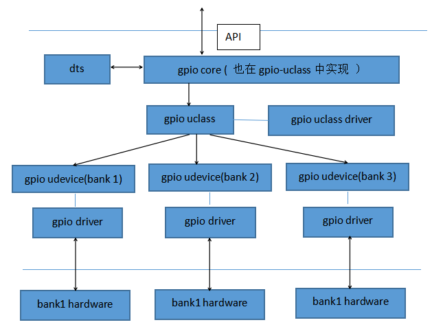

# 实例

------
## 1. serial驱动
### 1.1 定义uclass_driver 
```
UCLASS_DRIVER(serial) = {
	.id		= UCLASS_SERIAL,  //设置对应的uclass id，并且存放在.u_boot_list_2_uclass_2_serial段中
	.name		= "serial",
	.flags		= DM_UC_FLAG_SEQ_ALIAS,
	.post_probe	= serial_post_probe,
	.pre_remove	= serial_pre_remove,
	.per_device_auto_alloc_size = sizeof(struct serial_dev_priv),
};
```

### 1.2 dts文件中serial节点
```
				serial@02020000 {
					compatible = "fsl,imx6q-uart", "fsl,imx21-uart";
					reg = <0x2020000 0x4000>;
					interrupts = <0x0 0x1a 0x4>;
					clocks = <0x3 0xa0 0x3 0xa1>;
					clock-names = "ipg", "per";
					dmas = <0x8 0x19 0x4 0x0 0x8 0x1a 0x4 0x0>;
					dma-names = "rx", "tx";
					status = "okay";
					pinctrl-names = "default";
					pinctrl-0 = <0xc>;
				};

```

### 1.3 定义设备驱动
```
U_BOOT_DRIVER(serial_s5p) = {
    .name    = "serial_s5p",
    .id    = UCLASS_SERIAL,       // 这里的uclass_id和 uclass_driver中的一致
    .of_match = s5p_serial_ids,   // 设备树种的compatible属性
    .ofdata_to_platdata = s5p_serial_ofdata_to_platdata,
    .platdata_auto_alloc_size = sizeof(struct s5p_serial_platdata),
    .probe = s5p_serial_probe,
    .ops    = &s5p_serial_ops,
    .flags = DM_FLAG_PRE_RELOC,
};

static const struct udevice_id s5p_serial_ids[] = {
    { .compatible = "samsung,exynos4210-uart" },    //注意这里的compatible要和设备树中的一致
    { }
};

```

### 1.4 udevice和对应uclass的创建
**dm\_scan\_fdt**
```
fdtdec_get_chosen_node ------>  fdtdec_get_chosen_prop

	chosen { // chosen节点也位于根节点下，该节点用来给内核传递参数（不代表实际硬件）
            // 从串口输出
		stdout-path = "/soc/aips-bus@02000000/spba-bus@02000000/serial@02020000";
	};   

    
```
### 1.5 udevice和对应uclass的绑定
**核心解析函数lists\_bind\_fdt**

### 1.6 对应udevice的probe
```
int serial_init(void)
{
    // console的serial的初始化
    serial_find_console_or_panic();
    gd->flags |= GD_FLG_SERIAL_READY;
}

static void serial_find_console_or_panic(void)
{

    if (CONFIG_IS_ENABLED(OF_CONTROL) && blob) {

        // 获取指定的serial的dts节点

        // 调用uclass_get_device_by_of_offset，通过dts节点的偏移从uclass的设备链表中获取udevice，并且进行probe。
        if (!uclass_get_device_by_of_offset(UCLASS_SERIAL, node,
                            &dev)) {
            // 将udevice存储在gd->cur_serial_dev，后续uclass中可以直接通过gd->cur_serial_dev获取到对应的设备并且进行操作
            // 但是注意，这种并不是通用做法！！！
            gd->cur_serial_dev = dev;
            return;
        }
    }
}
```
### 1.7 uclass的接口调用
```
void serial_putc(char ch)
{
    if (gd->cur_serial_dev)
        // 将console对应的serial的udevice作为参数传入
        _serial_putc(gd->cur_serial_dev, ch);
}

static void _serial_putc(struct udevice *dev, char ch)
{
    // 获取设备对应的driver函数的ops操作集
    struct dm_serial_ops *ops = serial_get_ops(dev);
    int err;

    // 以udevice为参数，调用ops中对应的操作函数putc
    do {
        err = ops->putc(dev, ch);
    } while (err == -EAGAIN);
}

```


------
##  2. gpio驱动
### 2.1 dm-gpio架构
- gpio的驱动模型架构如图所示：  


#### 2.1.1 gpio core  
a) 为上层提供接口  
b) 从dts中获取GPIO属性  
c) 从gpio uclass的设备链表中获取对应udevice设备，并使用其操作集

#### 2.1.2 gpio uclass
a) 链接属于该uclass的所有udevice   
b) 为udevice的driver提供统一操作集接口

#### 2.1.3 bank和udevice
a) 在某些平台，把使用同一组寄存器的GPIO构成一个bank，但是不是所有的都有bank的概念，如果每个GPIO都有自己独立的寄存器，则可看成只有一个bank
b) 一个bank对应一个udevice，用bank中的偏移表示具体GPIO号
c) udevice的driver根据bank和offset来操作对应寄存器的bit

### 2.2 基本原理
a) 一个bank对应一个udevice，udevice中私有数据中存放着该bank的信息，比如相应寄存器地址等等
b) 上层通过调用gpio core的接口从dtsi获取到GPIO属性对应的gpio_desc描述符，用此描述符描述一个GPIO，它包括该GPIO所属的udevice、在bank内的偏移、以及标志位等
c) 上层使用gpio_desc描述符来作为调用gpio core的操作接口的参数
d) gpio core从gpio_desc描述符提取udevice，并调用其driver中对应的操作集，以bank内的偏移作为其参数（这样driver就能判断出是哪个GPIO了）
e) driver中提取udevice的私有数据中的bank信息，并进行相应的操作
f)


### 2.3  driver


### 2.4 uclass_driver


### 2.5 uclass


### 2.6 udevice


### 2.7 绑定流程
driver为uclass提供操作集，其中保存了uclass_id


根据uclass_id查询uclass driver列表获得uclass
udevice会放在两个地方，一个是uclass对应的udevice链表
一个是Device链表中

driver中有compatibile字段，通过检查它和dts节点中的compatible字段是否相同，获取节点名称，获取driver，生成udevice，uclass，并进行绑定

```
// 以serial为例， driver
U_BOOT_DRIVER(serial_s5p) = {
    .name    = "serial_s5p",
    .id    = UCLASS_SERIAL,
    .of_match = s5p_serial_ids,
    .ofdata_to_platdata = s5p_serial_ofdata_to_platdata,
    .platdata_auto_alloc_size = sizeof(struct s5p_serial_platdata),
    .probe = s5p_serial_probe,
    .ops    = &s5p_serial_ops,
    .flags = DM_FLAG_PRE_RELOC,
};

// 以serial-uclass为例，uclass driver
UCLASS_DRIVER(serial) = {
    .id        = UCLASS_SERIAL,
    .name        = "serial",
    .flags        = DM_UC_FLAG_SEQ_ALIAS,   
    .post_probe    = serial_post_probe,
    .pre_remove    = serial_pre_remove,
    .per_device_auto_alloc_size = sizeof(struct serial_dev_priv),
};

```

if(!a): a是假的执行
if(a): a是真的执行
