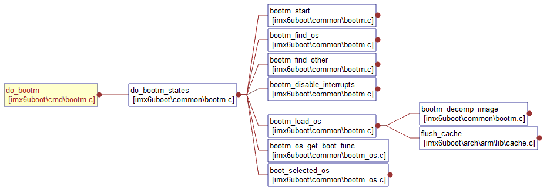
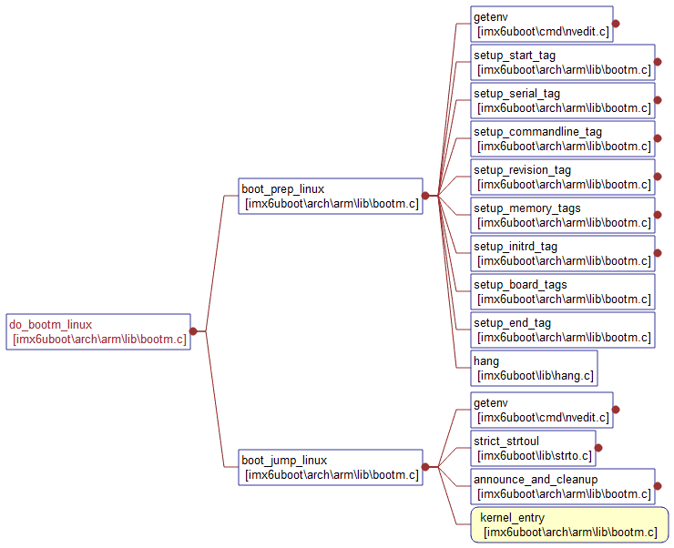

## **第6章-U-boot启动内核之二bootm启动内核**
> 整理自[uboot] uboot启动kernel篇（二）——bootm跳转到kernel的流程](http://blog.csdn.net/ooonebook/article/details/53495021#t1)

### **1. bootm简要说明**
> **宏定义使能：**  
CONFIG_BOOTM_LINUX=y  
CONFIG_CMD_BOOTM=y

#### **1.1 概要**
**bootm用于启动一个操作系统映像, 它会从映像文件的头部读取一些信息，如：映像文件的的cpu架构、操作系统类型、映像的类型、压缩方式、映像文件在内存中的加载地址、映像文件运行的入口地址、映像文件名等**  

#### **1.2 使用方式**
**a) 对于Legacy-uImage**
```
// 假设Legacy-uImage的加载地址是0x20008000，ramdisk的加载地址是0x21000000，fdt的加载地址是0x22000000

// 只加载kernel
bootm 0x20008000

// 加载kernel和ramdisk
bootm 0x20008000 0x21000000

// 加载kernel和fdt
bootm 0x20008000 - 0x22000000

// 加载kernel、ramdisk、fdt
bootm 0x20008000 0x21000000 0x22000000
```

**b) 对于FIT-uImage**
```
// 假设FIT-uImage的加载地址是0x30000000

// 启动内核
bootm 0x30000000
```

### **2. 执行流程**

#### **2.1 bootm函数**
```
// 以bootm 0x20008000 0x21000000 0x22000000为例
// 通过U_BOOT_CMD找到对应命令do_bootm
U_BOOT_CMD(
	bootm,	CONFIG_SYS_MAXARGS,	1,	do_bootm,
	"boot application image from memory", bootm_help_text
);

// cmdtp：_u_boot_list_2_cmd_2_bootm的指针
// argc=4
// argv[0]="bootm", argv[1]=0x20008000, arv[2]=0x21000000, argv[3]=0x22000000
int do_bootm(cmd_tbl_t *cmdtp, int flag, int argc, char * const argv[])
{
    // 去掉bootm参数
    ....
    // 此时argc=3
    // argv[0]=0x20008000 , argv[1]=0x21000000, argv[2]=0x22000000
    return do_bootm_states(cmdtp, flag, argc, argv, ...., &images, 1);    
}
```

#### **2.2 do_bootm_states函数**
##### **2.2.1 bootm_headers_t数据结构**
> bootm根据参数指向的镜像填充此结构体，然后使用结构体的内容填充kernel的启动信息，进行跳转

```
typedef struct bootm_headers {
    image_header_t  *legacy_hdr_os;      // Legacy-uImage的镜像头
    image_header_t  legacy_hdr_os_copy;  // Legacy-uImage的镜像头备份
    ulong       legacy_hdr_valid;        // Legacy-uImage的镜像头是否存在的标记
#if IMAGE_ENABLE_FIT // 使能FIT
    const char  *fit_uname_cfg;     // 配置节点名
    void        *fit_hdr_os;        // FIT-uImage中kernel镜像头
    const char  *fit_uname_os;      // FIT-uImage中kernel的节点名
    int     fit_noffset_os;         // FIT-uImage中kernel的节点偏移
    void        *fit_hdr_rd;        // FIT-uImage中ramdisk的镜像头
    const char  *fit_uname_rd;      // FIT-uImage中ramdisk的节点名
    int     fit_noffset_rd;         // FIT-uImage中ramdisk的节点偏移
    void        *fit_hdr_fdt;       // FIT-uImage中FDT的镜像头
    const char  *fit_uname_fdt;     // FIT-uImage中FDT的节点名
    int     fit_noffset_fdt;        // FIT-uImage中FDT的节点偏移
#endif
    image_info_t    os;           // 操作系统信息的结构体
    ulong       ep;               // 操作系统的入口地址
    ulong       rd_start, rd_end; // ramdisk在内存上的起始地址和结束地址
    char        *ft_addr;         // fdt在内存上的地址
    ulong       ft_len;           // fdt在内存上的长度
    int     state;                // 状态标识，用于标识对应的bootm需要做什么操作

} bootm_headers_t;
```
##### **2.2.2 状态说明**
> do_bootm_states根据states来判断要执行的操作

```
// 开始执行bootm的一些准备动作
#define BOOTM_STATE_START (0x00000001)
// 查找操作系统镜像
#define BOOTM_STATE_FINDOS (0x00000002)
// 查找操作系统镜像外的其他镜像，比如FDT\ramdisk等等
#define BOOTM_STATE_FINDOTHER (0x00000004)
// 加载操作系统
#define BOOTM_STATE_LOADOS (0x00000008)
// 操作ramdisk
#define BOOTM_STATE_RAMDISK (0x00000010)
// 操作FDT
#define BOOTM_STATE_FDT (0x00000020)
// 操作commandline
#define BOOTM_STATE_OS_CMDLINE (0x00000040)
// 跳转到操作系统的前的准备动作
#define BOOTM_STATE_OS_BD_T (0x00000080)
#define BOOTM_STATE_OS_PREP (0x00000100)
// 伪跳转，一般都能直接跳转到kernel中去
#define BOOTM_STATE_OS_FAKE_GO (0x00000200)
// 跳转到kernel中去
#define BOOTM_STATE_OS_GO (0x00000400)
```

#### **2.3 执行流程**

```
// 根据states判断要执行的操作
int do_bootm_states(cmd_tbl_t *cmdtp, int flag, int argc, char * const argv[],
		    int states, bootm_headers_t *images, int boot_progress)
{
	// *****************解析uImage***************************//
	// 保存states到bootm_headers_t images内部
	images->state |= states;  

	// BOOTM_STATE_START
  	if (states & BOOTM_STATE_START)
	  	ret = bootm_start(cmdtp, flag, argc, argv);

	 // BOOTM_STATE_FINDOS
  	if (!ret && (states & BOOTM_STATE_FINDOS))
	  ret = bootm_find_os(cmdtp, flag, argc, argv);

	// BOOTM_STATE_FINDOTHER
  	if (!ret && (states & BOOTM_STATE_FINDOTHER)) {
	  ret = bootm_find_other(cmdtp, flag, argc, argv);
	  argc = 0;   /* consume the args */
  	}
  	// ********************解析uImage结束************************//
	 // BOOTM_STATE_LOADOS
  	if (!ret && (states & BOOTM_STATE_LOADOS)) {
	  ulong load_end;
	  iflag = bootm_disable_interrupts();
	  ret = bootm_load_os(images, &load_end, 0);
  	}

	// 是否需要重定向ramdinsk，do_bootm流程不需要
	#ifdef CONFIG_SYS_BOOT_RAMDISK_HIGH
  	if (!ret && (states & BOOTM_STATE_RAMDISK)) {
	  ulong rd_len = images->rd_end - images->rd_start;
	  ret = boot_ramdisk_high(&images->lmb, images->rd_start,
		  rd_len, &images->initrd_start, &images->initrd_end);
  	}
	#endif

	// 是否需要重定向fdt，do_bootm流程不需要
	#if IMAGE_ENABLE_OF_LIBFDT && defined(CONFIG_LMB)
    if (!ret && (states & BOOTM_STATE_FDT)) {
	  boot_fdt_add_mem_rsv_regions(&images->lmb, images->ft_addr);
	  ret = boot_relocate_fdt(&images->lmb, &images->ft_addr,
				  &images->ft_len);
    }
	#endif

	// 获取OS启动函数, 如下：
	boot_fn = bootm_os_get_boot_func(images->os.os);

	// 跳转到OS前的准备动作，会直接调用启动函数，但是标识是BOOTM_STATE_OS_PREP
	if (!ret && (states & BOOTM_STATE_OS_PREP))
		ret = boot_fn(BOOTM_STATE_OS_PREP, argc, argv, images);

	// BOOTM_STATE_OS_GO标识，跳转到操作系统中，并且不应该再返回了
	if (!ret && (states & BOOTM_STATE_OS_GO))
		ret = boot_selected_os(argc, argv, BOOTM_STATE_OS_GO,
			  images, boot_fn);
}

// 根据OS类型获得到对应的操作函数
boot_os_fn *bootm_os_get_boot_func(int os)
{
    return boot_os[os];
}

// 获取启动函数
static boot_os_fn *boot_os[] = {
	// linux内核启动函数
	[IH_OS_LINUX] = do_bootm_linux,
	....
}
```
**跳转到内核**   


```
int do_bootm_linux(int flag, int argc, char * const argv[],
           bootm_headers_t *images)
{
	// 实现跳转到linux前的准备动作
    boot_prep_linux(images);
	// 跳转到linux内核中
    boot_jump_linux(images, flag);
}

// 主要任务是修复LMB，并把它填入到fdt中
// LMB是指Logical Memory blocks，用于表示内存保留区域，主要有fdt的区域，ramdisk区域等
static void boot_prep_linux(bootm_headers_t *images)
{
	char *commandline = getenv("bootargs");
	if (IMAGE_ENABLE_OF_LIBFDT && images->ft_len) {
#ifdef CONFIG_OF_LIBFDT
		if (image_setup_linux(images)) {
			hang();
		}
#endif
}

/* Subcommand: GO */
static void boot_jump_linux(bootm_headers_t *images, int flag)
{
	// 从gd中获取machine-id
	unsigned long machid = gd->bd->bi_arch_number;

	// kernel入口函数，即kernel的入口地址，对应kernel的_start段地址
	void (*kernel_entry)(int zero, int arch, uint params);  

	// 伪跳转，并不真正地跳转到kernel中
	int fake = (flag & BOOTM_STATE_OS_FAKE_GO);

	// 设置kernel的入口地址
	kernel_entry = (void (*)(int, int, uint))images->ep;

	// 把fdt的地址放人r2寄存器中
	if (IMAGE_ENABLE_OF_LIBFDT && images->ft_len)
		r2 = (unsigned long)images->ft_addr;
	else
		r2 = gd->bd->bi_boot_params;

	// 执行kernel_entry, 跳转到kernel内核中
	kernel_entry(0, machid, r2);

}
```
