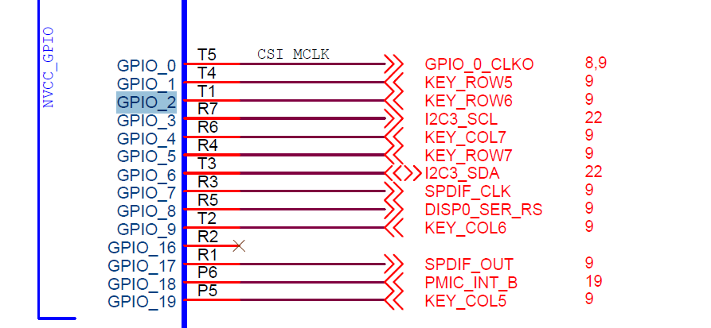
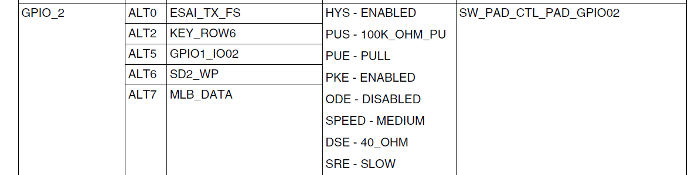
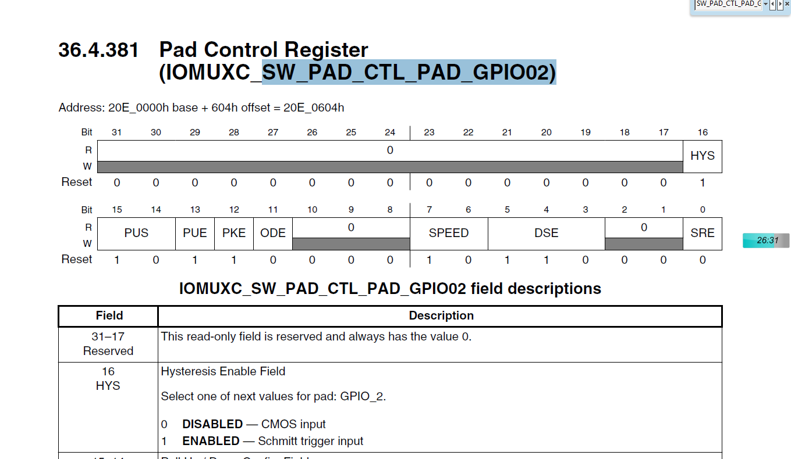
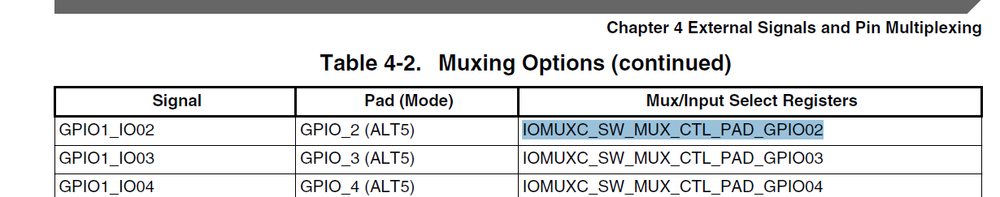
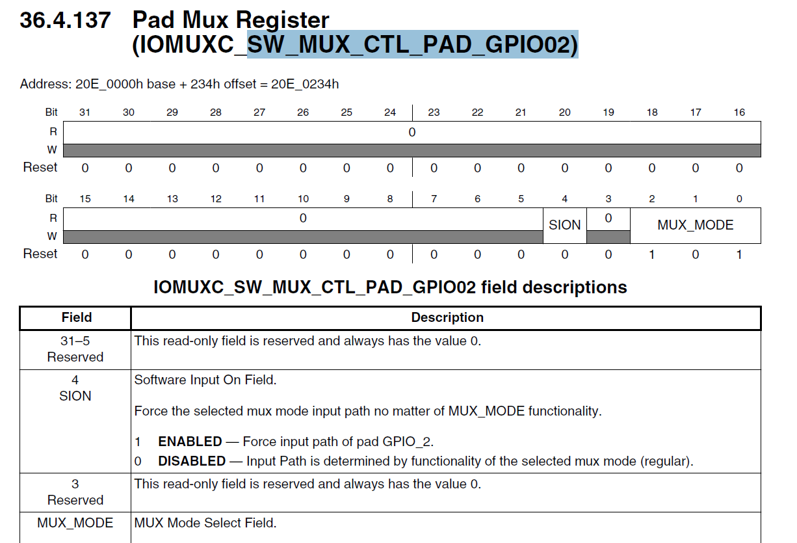
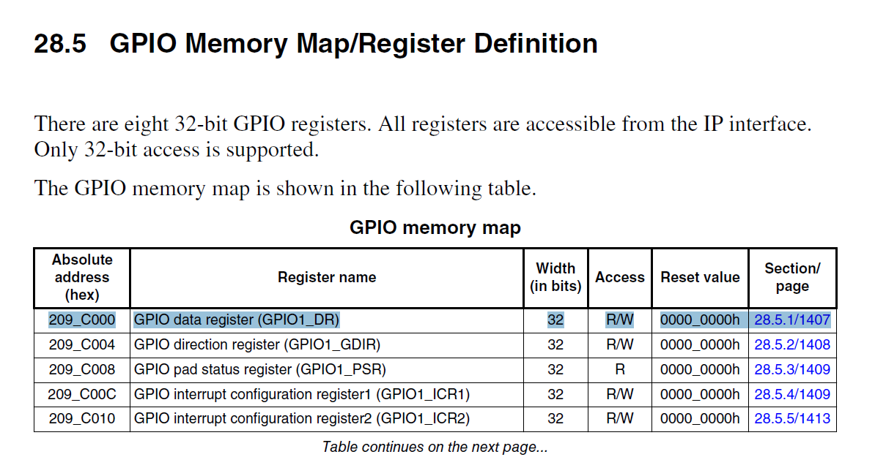
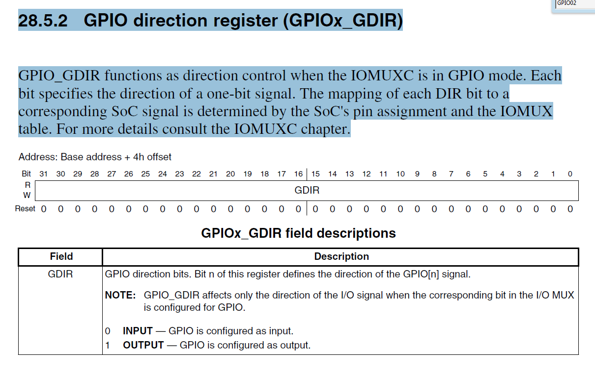
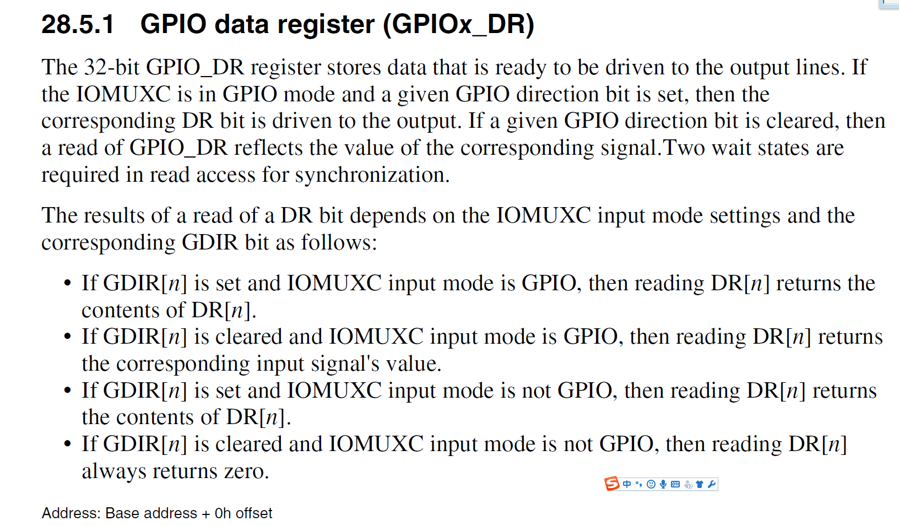
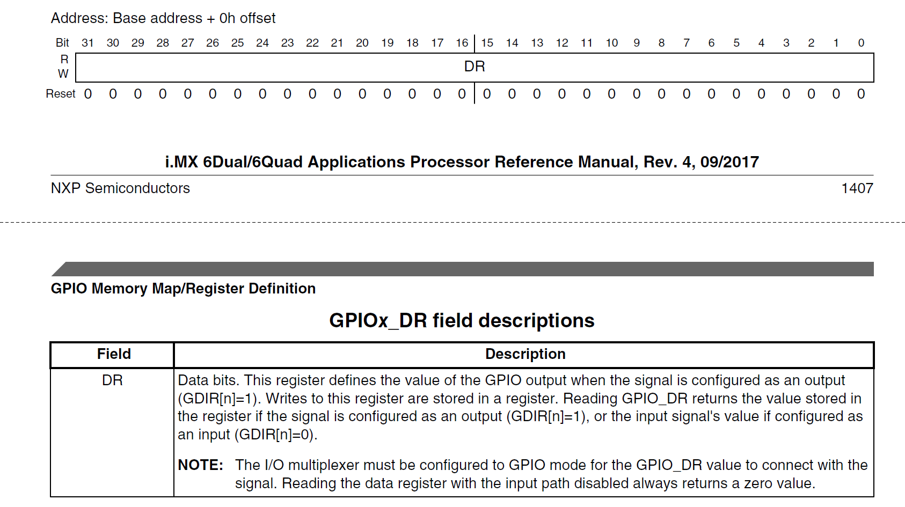
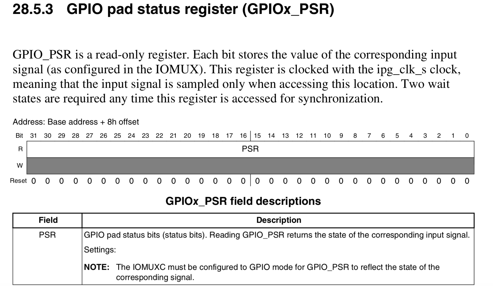

## **第8章-U-boot管脚复用**
> 需要配置寄存器：pad控制器，Mux控制器，select input寄存器和Data寄存器   
配置IOMUX的必备工具：1.芯片原理图；2.芯片软件手册； 3.内核源代码

### **1. 查看原理图**
**找到KEY_ROW6对应的GPIO_2**  


### **2. 找到对应的Pad/Group Registers**
**找到GPIO_2对应的控制寄存器 SW_PAD_CTL_PAD_GPIO02**   


**SW_PAD_CTL_PAD_GPIO02寄存器: 控制引脚上拉电阻、下拉电阻和电源控制**     


### **3. 根据ALT5:GPIO1_IO02查找IOMUXC寄存器**
**a) IOMUXC：IOMUX_SW_MUX_CTL_PAD_GPIO02**   
> GPIO1_IO02代表GPIO1组寄存器的第02个寄存器，也就是第3位



**b) GPIO_2的功能ALT5:GPIO1_IO02用于查找其他寄存器**   
> 设置ALT5: 101模式



### **4. GPIO编程**
#### **4.1 读操作**
**1. 通过配置IOMUXC控制器使得IOMUX选择GPIO模式**    
**2. 配置GPIO direction register为input模式(GPIO_GDIR[GDIR]设置为0)**  
**3. 从data寄存器读值**  
> While the GPIO direction is set to input (GPIO_GDIR = 0), a read access to GPIO_DR does not return GPIO_DR data. Instead, it returns the GPIO_PSR data, which is the corresponding input signal value.实际上PSR才是读到的值

```
// SET INPUTS TO GPIO MODE.
write sw_mux_ctl_<input0>_<input1>_<input2>_<input3>, 32'h00000000
// SET GDIR TO INPUT.
write GDIR[31:4,input3_bit, input2_bit, input1_bit, input0_bit,] 32'hxxxxxxx0
// READ INPUT VALUE FROM DR.
read DR
// READ INPUT VALUE FROM PSR.  
read PSR

```

#### **4.2 写操作**
**1. 通过配置IOMUXC控制器使得IOMUX选择GPIO模式，如果需要通过PSR寄存器读取值，则需要enable SION位(通常置1)**    
**2. 配置GPIO direction register为output模式(GPIO_GDIR[GDIR]设置为1)**  
**3. 向data寄存器写值(GPIO_DR)**  

```
// SET PADS TO GPIO MODE VIA IOMUX.
write sw_mux_ctl_pad_<output[0-3]>.mux_mode, <GPIO_MUX_MODE>
// Enable loopback so we can capture pad value into PSR in output mode
write sw_mux_ctl_pad_<output[0-3]>.sion, 1
// SET GDIR=1 TO OUTPUT BITS.
write GDIR[31:4,output3_bit,output2_bit, output1_bit, output0_bit,] 32'hxxxxxxxF
// WRITE OUTPUT VALUE=4’b0101 TO DR.
write DR, 32'hxxxxxxx5
// READ OUTPUT VALUE FROM PSR ONLY.
read_cmp PSR, 32'hxxxxxxx5
```

### **5. 配置GDIR, PSR, DR寄存器**
**GPIO1寄存器组基地址**
> GPIO1_IO02: IO02代表第3个寄存器，其他寄存器根据偏移量指定



#### **5.1 配置GDIR方向寄存器**
> 0x000 0100



#### **5.2 配置DR数据寄存器**



#### **5.3 从PSR寄存器读取值**



### **6. 实例**
> **点亮上面流程中的LED灯**   

#### **6.1 设置复用功能控制器IOMUX为GPIO模式**
```
// 复用控制器地址
volatile  uint_32  *p_GPIO02_IOMUX = (uint_32*)0x20E0234u;
// 配置
*p_GPIO02_IOMUX &= 0;    // 清MUX位段
*p_GPIO02_IOMUX |= 0x15; // 设置为GPIO模式

```

#### **6.2 设置方向寄存器GDIR**
```
// 基地址
volatile  uint_32  *p_BASE = (uint_32*)0x209C000u;
// 方向寄存器地址
volatile  uint_32  *p_GPIO_GDIR = p_BASE + 4;
// 1为output输出模式
*p_GPIO_GDIR |= (1 << 2)
// 0位input输入模式
*p_GPIO_GDIR &= ~(1 << 2)
```

#### **6.3 设置数据寄存器DR**
```
// 数据寄存器地址
volatile  uint_32  *p_GPIO_DR   = p_BASE + 0;
// 亮
*p_GPIO_DR |= (1<<2);
// 灭
*p_GPIO_DR &= ~(1<<2);
```

#### **6.4 查看PSR寄存器**
```
// PSR寄存器基地址
volatile  uint_32  *p_GPIO_PSR  = p_BASE + 8;
// 查看PSR内容
*p_GPIO_PSR
```
