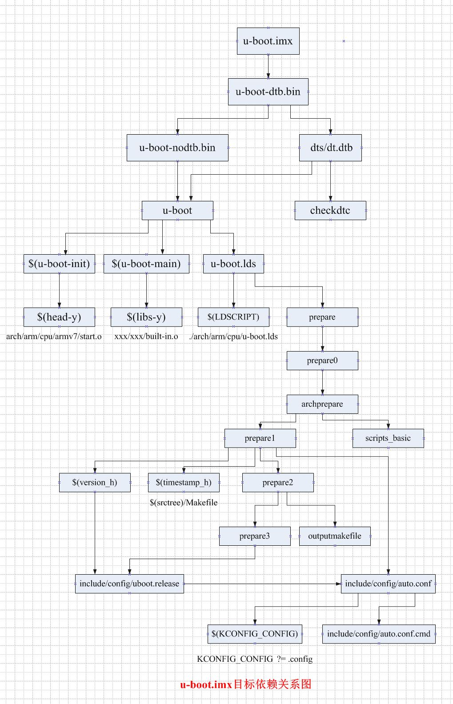

# 第9章-uboot编译之编译过程
[u-boot-2016.09 make编译过程分析(一)](http://blog.csdn.net/guyongqiangx/article/details/52558087)
> Makefile核心是依赖和命令；对于每个目标，会先检查依赖，如果依赖存在则执行命令更新目标；如果依赖不存在，则会以依赖为目标，先生成依赖，依赖生成后，则执行命令

##  1. 
```
%.imx: %.bin
	$(Q)$(MAKE) $(build)=arch/arm/imx-common $@


u-boot.imx: u-boot.bin
    $(Q) make $(build)=arch/arm/imx-common u-boot.imx

u-boot.bin: u-boot-dtb.bin FORCE
	$(call if_changed,copy)

u-boot-dtb.bin: u-boot-nodtb.bin dts/dt.dtb FORCE
	$(call if_changed,cat)

u-boot-nodtb.bin: u-boot FORCE
	$(call if_changed,objcopy)
	$(call DO_STATIC_RELA,$<,$@,$(CONFIG_SYS_TEXT_BASE))
	$(BOARD_SIZE_CHECK)

dts/dt.dtb: checkdtc u-boot
	$(Q)$(MAKE) $(build)=dts dtbs

PHONY += dtbs
dtbs: dts/dt.dtb
	@:

u-boot:	$(u-boot-init) $(u-boot-main) u-boot.lds FORCE
	$(call if_changed,u-boot__)
ifeq ($(CONFIG_KALLSYMS),y)
	$(call cmd,smap)
	$(call cmd,u-boot__) common/system_map.o
endif

```

### $(u-boot-init)
```
u-boot-init := $(head-y)
head-y := arch/arm/cpu/$(CPU)/start.o
CONFIG_SYS_CPU="armv7"  
```

###  $(u-boot-main) 
```
u-boot-main := $(libs-y)
libs-y += lib/
libs-y += fs/
libs-y += net/
libs-y += disk/
libs-y += drivers/
libs-y += drivers/dma/
libs-y += drivers/gpio/
libs-y += drivers/i2c/
libs-y += drivers/mmc/
libs-y += drivers/mtd/
libs-y += drivers/mtd/onenand/
libs-y += drivers/mtd/spi/
libs-y += drivers/net/
libs-y += drivers/net/phy/
libs-y += drivers/pci/
libs-y += drivers/power/ \
	drivers/power/domain/ \
	drivers/power/fuel_gauge/ \
	drivers/power/mfd/ \
	drivers/power/pmic/ \
	drivers/power/battery/ \
	drivers/power/regulator/
libs-y += drivers/spi/
libs-y += drivers/serial/
libs-y += drivers/usb/dwc3/
libs-y += drivers/usb/common/
libs-y += drivers/usb/emul/
libs-y += drivers/usb/eth/
libs-y += drivers/usb/gadget/
libs-y += drivers/usb/gadget/udc/
libs-y += drivers/usb/host/
libs-y += drivers/usb/musb/
libs-y += drivers/usb/musb-new/
libs-y += drivers/usb/phy/
libs-y += drivers/usb/ulpi/
libs-y += cmd/
libs-y += common/
libs-y += test/
libs-y += test/dm/

libs-y += board/freescale/mx6qsensorgw

libs-y := $(sort $(libs-y))
libs-y		:= $(patsubst %/, %/built-in.o, $(libs-y))
xxx/xxx/built-in.o
```

### u-boot.lds 
> ARCH := arm; CPU := armv7; BOARD := mx6qsensorgw; VENDOR := freescale; SOC := mx6

```
u-boot.lds: $(LDSCRIPT) prepare FORCE
	$(call if_changed_dep,cpp_lds)

# 根据.config的配置，以及Makefile文件可以得出
LDSCRIPT := ./arch/arm/cpu/u-boot.lds


prepare: prepare0


prepare0: archprepare FORCE
	$(Q)$(MAKE) $(build)=.

archprepare: prepare1 scripts_basic

prepare1: prepare2 $(version_h) $(timestamp_h) include/config/auto.conf

prepare2: prepare3 outputmakefile

prepare3: include/config/uboot.release

outputmakefile:
ifneq ($(KBUILD_SRC),)
	$(Q)ln -fsn $(srctree) source
	$(Q)$(CONFIG_SHELL) $(srctree)/scripts/mkmakefile \
	    $(srctree) $(objtree) $(VERSION) $(PATCHLEVEL)
endif


$(version_h): include/config/uboot.release FORCE
	$(call filechk,version.h)

$(timestamp_h): $(srctree)/Makefile FORCE
	$(call filechk,timestamp.h)

include/config/uboot.release: include/config/auto.conf FORCE
	$(call filechk,uboot.release)

include/config/%.conf: $(KCONFIG_CONFIG) include/config/auto.conf.cmd


```



-----

